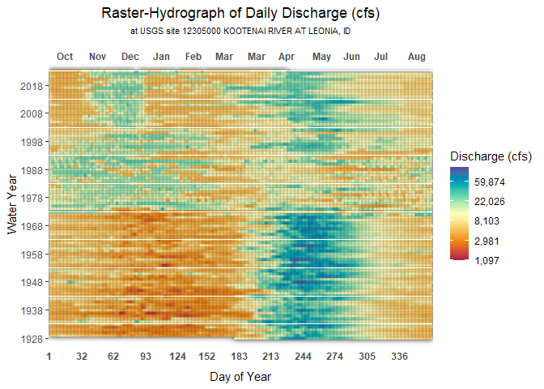
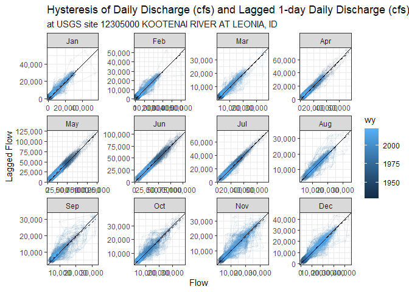

<!-- README.md is generated from README.Rmd. Please edit that file -->

# whitewater.extras

<!-- badges: start -->

[](https://lifecycle.r-lib.org/articles/stages.html#stable)
<!-- badges: end -->

The goal of whitewater.extras is to provide *extra* functionality to the
[{whitewater}](https://github.com/joshualerickson/whitewater) through
animation and visualization for exploratory data analysis (EDA) or just
for fun!

## Warning

Very new and very unstable so the more issues submitted the better for
development and user experience. Thank you!

## Installation

You can install the development version of whitewater.extras from
[GitHub](https://github.com/) with:

``` r
# install.packages("devtools")
devtools::install_github("joshualerickson/whitewater.extras")

### will need the current dev version of {whitewater} for now
devtools::install_github("joshualerickson/whitewater")
```

## Example

This is a basic example which shows you how to solve a common problem:
look at a hydrograph in different ways.

``` r
library(whitewater.extras)
library(whitewater)
#>  Due to potentially crashing (USGS Water Services) REST services 
#>  parallel processing is kept to  120 requests/min. 
#>  Thank you!

#provide a USGS site number that you want to look at visually (we need the data first)
kootenai_river <- ww_dvUSGS(sites = '12305000')
#> ✔ KOOTENAI RIVER AT LEONIA, ID 'daily' was successfully downloaded.
```

**Raster Hydrograph**

``` r
ww_raster_hydrograph(daily_values = kootenai_river, value_name = Flow)
```



**Flow Hysteresis**

``` r
ww_hysteresis_plot(daily_values = kootenai_river, value_name = Flow)
```



**Animation**

This provides a side-by-side view of a hydrograph per water year and
raster hydrograph.

``` r
ww_animate_hydrograph(daily_values = kootenai_river)
```

<center>


</center>
